# Aiida example

The example AiiDA database contains three crystals:

- diamond (C2) (uuid: `4453cd37-17fd-4022-b571-ccd639bb6bd0`);
- GaAs (uuid: `598c08c4-793f-4afb-b39e-d0c947821c6f`);
- MgO (uuid: `c52d8ad2-2440-4b00-99ab-39b987d88c18`),

```mermaid
graph LR;
  A("Initial crystal<br>(StructureData)") --> B["PwBandsWorkChain"];
  B --> C("Relaxed crystal<br>(StructureData)");
  B --> D("SCF parameters<br>(Dict)");
  B --> E("Band structure<br>(BandsData)");
  E --> F["get_bandgap<br>(CalcFunctionNode)"];
  F --> G("Band gap results<br>(Dict)");

  style A fill:#004400;
  style B fill:#442200;
  style C fill:#004400;
  style D fill:#004400;
  style E fill:#004400;
  style F fill:#442200;
  style G fill:#004400;
```

where C2 and GaAs have band structures calculated with Quantum Espresso, and MgO has no calculations done on it. The band structure calculation provenance is shown in the following schematic:

We want to include the "Relaxed crystal" nodes as OPTIMADE structures, and include custom properties from the various other AiiDA nodes (e.g. the band gap value from the "Band gap results" node). The example `optimade.yaml` shows how to achieve this.
